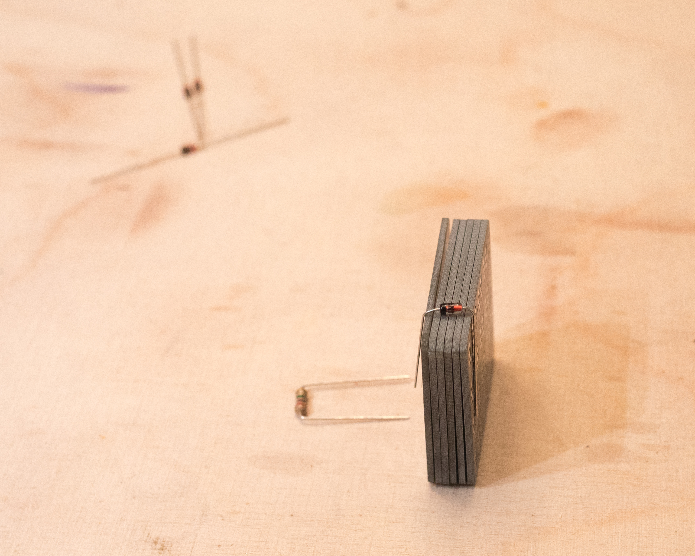
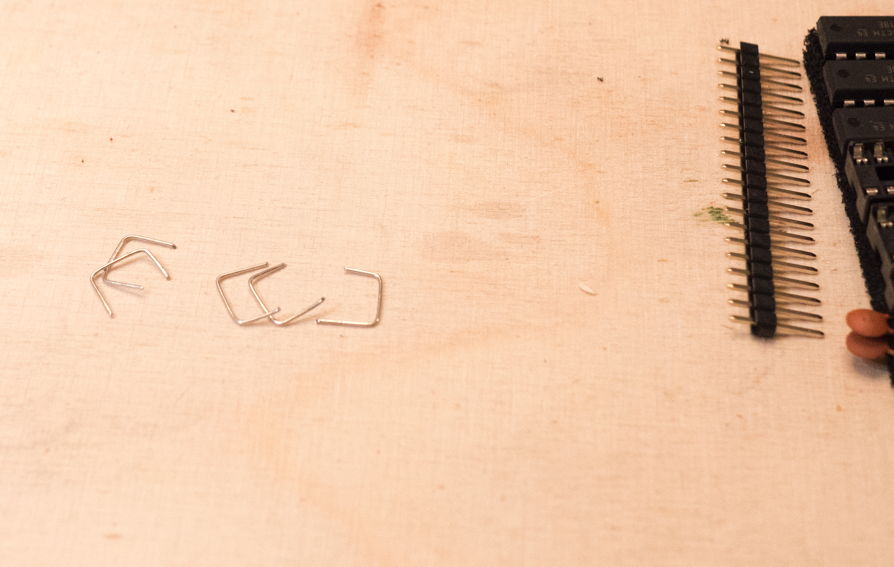
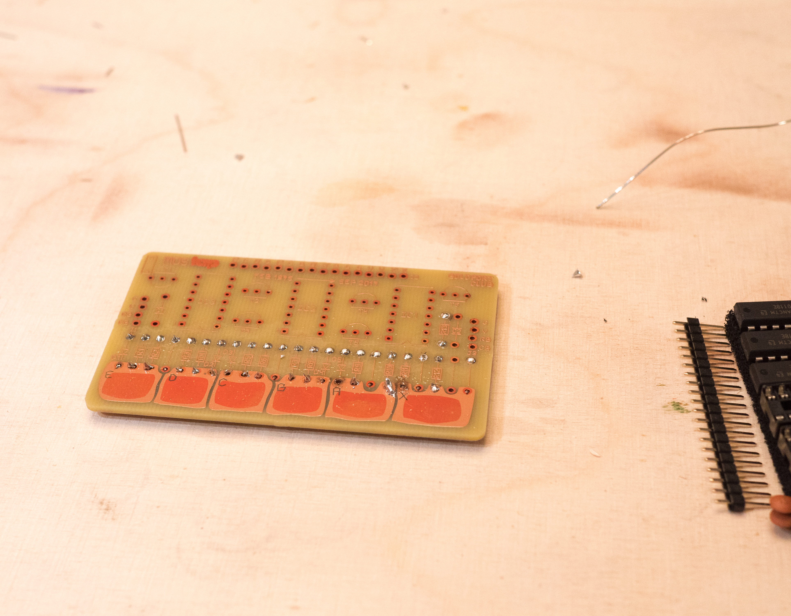

# p17-mostap

Build information around the Boldport Club project 17 - MOSTAP -- or this is how I did it, step by step... 😃

## Unpacking

## The pieces

Here I clipped the the paper strips off to avoid messing up the legs and ordered them:

Next I prepared the 1M and 10M resistors by bending the legs directly at the body:

## The works

As usual the mounting order with through hole components is from lowest to highest profile. I made two slight exceptions for the straight connections (for which I needed the clippings which I didn't have yet) and the diodes which require special care while bending to get the right length...

First I started by placing the 1M and 10M resistors into the right holes:

Then I bent the pins on the solder side of the board to keep them in place:

Then I prepared the diodes with the help of a stack of PCBs:

The parts are kept in place using high-end "Kepton" tape:

** Make sure to the values correct before soldering **

Then I clipped the pins as close as possible to the board before soldering in the hope to get some dome-ing on...

Next was some basic soldering to keep the components in place:

Then I could bend the clippings for the 5 straight connections (again utilising the stack of PCBs):

Work in progress after putting in the bridges:

I had to use a lot of flux to make the copper solderable...

First row of solder joints properly done...

And more fluxing:

Second row was very problematic; I actually had to use a small screw driver to scratch off some solder mask around the holes to make them solderable... Also note how the flux changes the tone of the pads...

After plenty of scraping and fluxing (gave up the idea of creating domes):

Next the sockets:

Then the capacitors (make sure to use the right values):

Then the transistors (check the markings on the board):

I clipped two pins at the board and kept one in case I needed to adjust it. (The "goo" is Löthonig which I also tested here, looks crazy but is really good 👍):

Soldering is done, MOSFETs put in:

Toothbrush and alcohol cleanup:

Additional swabbing:

## The final product

Testing with with p13 "cordwood-too":

